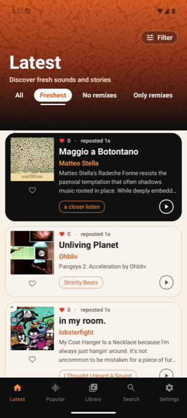
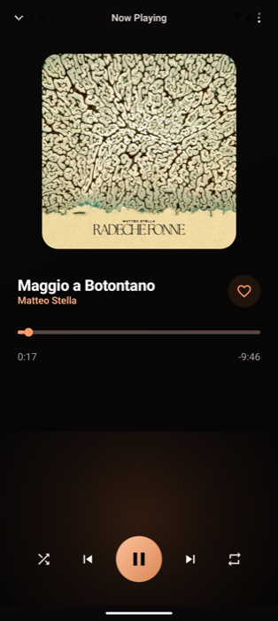
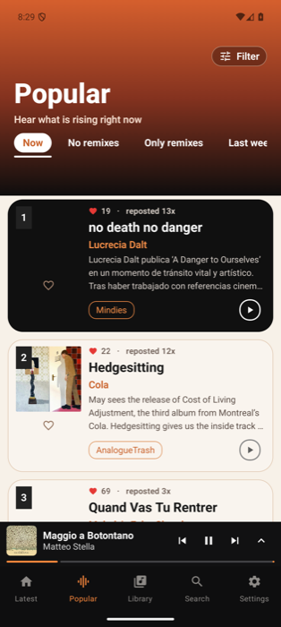
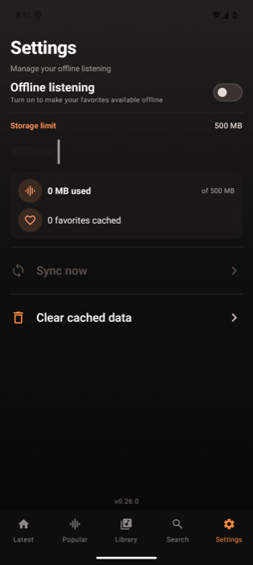
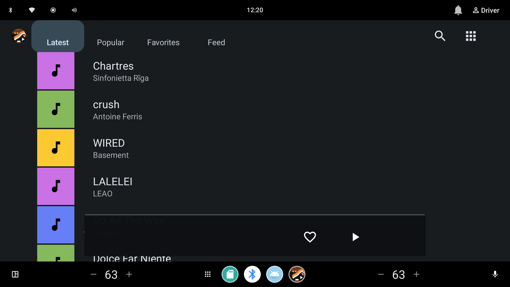
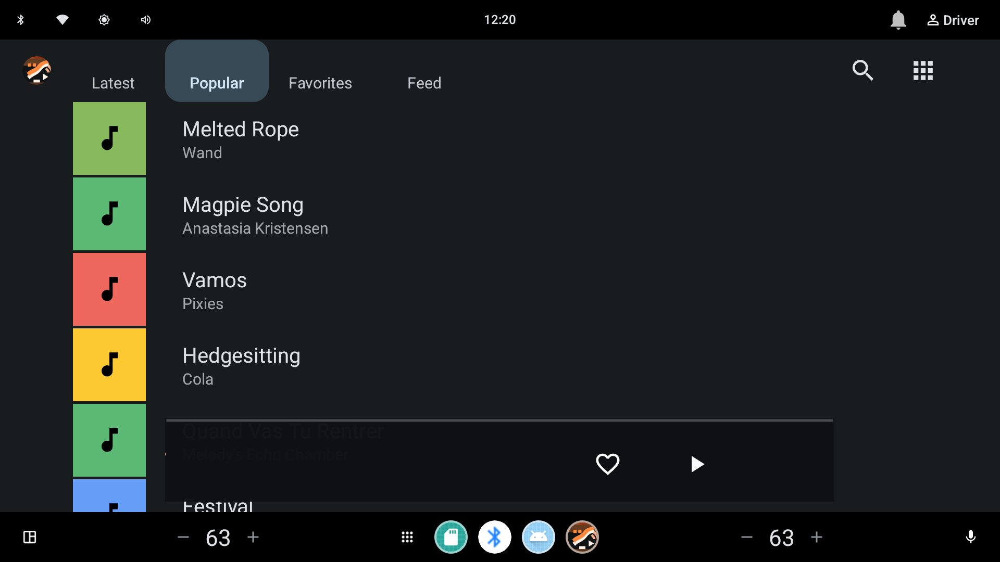
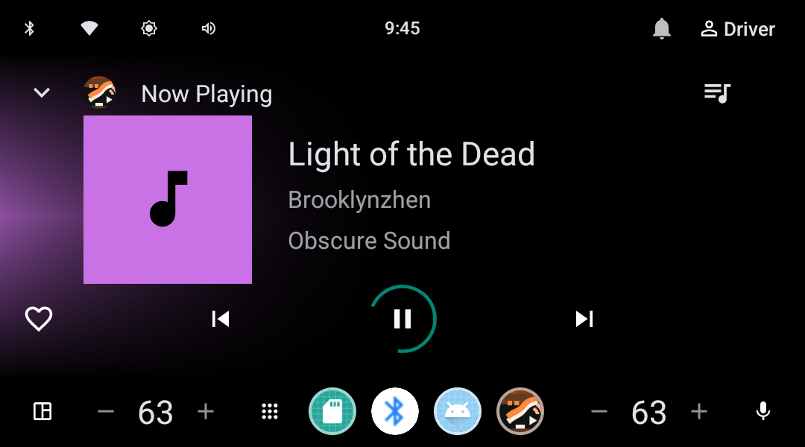
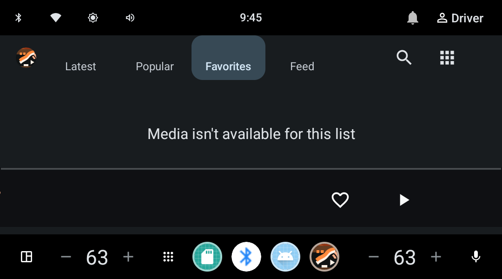
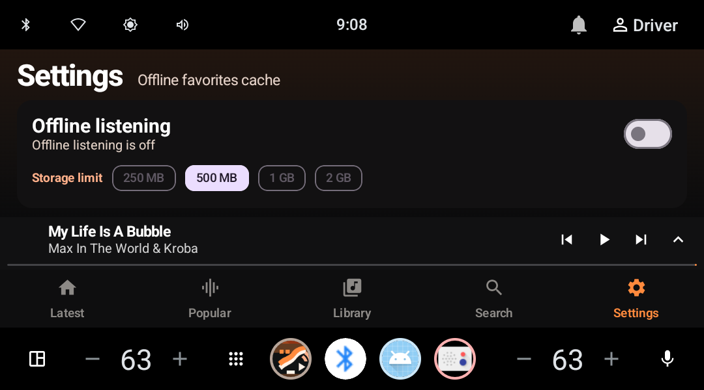

# Hype Car

[](.github/workflows/build.yml)
[](CHANGELOG.md)
[](CHANGELOG.md)
[](LICENSE)
[](gradle.properties)
[](gradle.properties)

Unofficial open-source Hype Machine client for Android phones and Android Auto / Automotive OS. Streams from `api.hypem.com` and exposes a Media3 `MediaLibraryService` so Android Auto can browse and play your Hype Machine library.

> Not affiliated with or endorsed by Hype Machine.

## Screenshots

### Phone (Pixel 9 Pro XL)

| Latest | Player | Popular | Settings |
| --- | --- | --- | --- |
|  |  |  |  |

### Android Automotive (AAOS) — system Media Templates

What you actually see in a car: the head unit's media app renders our `MediaLibraryService` through the AAOS Media Templates — same surface Spotify, YouTube Music, etc. use. Browse roots come from our `MediaLibrarySession.Callback`; the playback chrome is system-rendered.

| Latest | Popular | Now Playing | Signed-out Favorites |
| --- | --- | --- | --- |
|  |  |  |  |

The heart in the Now Playing transport row is a `CommandButton` wired to a custom `SessionCommand` — tapping it calls `MeRepository.toggleFavorite(...)` for the playing track, with optimistic UI and server-confirmed rollback. The Favorites/Feed/Playlists roots gate on `AuthRepository.session` and return a non-playable placeholder when there's no Hype Machine login, so the system shows "Media isn't available" instead of a generic error.

> Captured by launching `com.android.car.media` with `-a android.car.intent.action.MEDIA_TEMPLATE` against `dev.josu.hypecar/dev.josu.hypecar.auto.service.HypeMediaLibraryService` on the AAOS_API_35 emulator.

### AAOS — Compose immersive UI (when launched directly)

When the user taps the app icon on AAOS (rather than going through the car's media app), they land in our Compose UI — a compact landscape variant of the phone layout.

| Compose Settings |
| --- |
|  |

## Modules

```
app/                  Phone shell (Compose UI, navigation, mini-player chrome)
auto/                 Media3 MediaLibraryService + MediaLibrarySession.Callback for AAOS / Auto
core/
  model/              Domain models, repository interfaces, coroutine helpers
  network/            Retrofit API + DTOs + auth interceptor
  data/               Room DB, DataStore, repositories, OkHttp wiring, offline sync worker
  playback/           ExoPlayer wrapper (HypePlaybackManager) + foreground-service starter
feature/
  auth/               Login flow + ViewModel
  catalog/            Latest / Popular routes
  library/            Library route (favorites, playlists, friends, history)
  search/             Search route
  details/            Blog / Tag / User detail routes
  player/             Full-screen player UI
scripts/              Dev helpers (HypeM dev proxy, AAOS Wi-Fi reconnect)
```

## Tech stack

- **UI:** Jetpack Compose · Material 3 · Navigation Compose
- **DI:** Hilt + KSP
- **Data:** Room · DataStore (Preferences) · WorkManager (offline sync)
- **Networking:** Retrofit · OkHttp · `okhttp-dnsoverhttps` fallback (`ResilientDns`) · `kotlinx.serialization`
- **Playback:** Media3 ExoPlayer + `MediaLibrarySession`
- **Images:** Coil
- **Build:** AGP 8.7.3 · Kotlin 2.0.21 · JDK 17 · Gradle 8.10.2
- **Testing:** JUnit4 · Truth · MockWebServer · Robolectric · Kotlinx Coroutines Test
- **Coverage:** Kover (`./gradlew koverHtmlReport` → `build/reports/kover/html/index.html`)
- **CI:** GitHub Actions (`.github/workflows/build.yml`) — tests + lint + Kover + release packaging

SDK levels (`gradle.properties`): `compileSdk=35`, `targetSdk=35`, `minSdk=26`.

## Building

Requires JDK 17. The Gradle wrapper handles everything else.

```bash
# Run unit tests + lint (fast)
./gradlew testDebugUnitTest lintDebug

# Build a debug APK
./gradlew :app:assembleDebug

# Build release artifacts (unsigned unless signing env vars are set)
./gradlew :app:assembleRelease :app:bundleRelease
```

Outputs land in `app/build/outputs/`.

### Release signing

Provide the keystore via Gradle properties or environment variables — never commit them. See `RELEASE.md` for the full checklist.

```bash
export HYPE_RELEASE_STORE_FILE=/absolute/path/to/release.keystore
export HYPE_RELEASE_STORE_PASSWORD='...'
export HYPE_RELEASE_KEY_ALIAS='...'
export HYPE_RELEASE_KEY_PASSWORD='...'

./gradlew clean testDebugUnitTest lintDebug bundleRelease
# → app/build/outputs/bundle/release/app-release.aab
```

If the signing variables are absent, Gradle still produces an unsigned release artifact for local verification.

## Running on Android Auto / AAOS

The app declares an automotive media app (`res/xml/automotive_app_desc.xml` → `<uses name="media" />`) and a `HypeMediaLibraryService` that satisfies the AAOS browser tree contract.

For AAOS emulator development, the `core:data` debug build enables `ENABLE_AAOS_DEV_PROXY`, which routes requests through `http://10.0.2.2:8787/v2/` when the runtime detects an automotive emulator. Run the proxy locally:

```bash
python3 scripts/hypem_api_proxy.py
```

Release builds always go directly to `https://api.hypem.com/v2/`.

## Networking & security

- `cleartextTrafficPermitted="false"` in the base network security config; debug variant whitelists `10.0.2.2` / `localhost` only.
- `HypeApiInterceptor` injects the auth token (`hm_token` query param) **only** for `api.hypem.com` and the dev proxy hosts.
- The auth token is encrypted at rest with Android Keystore (AES-GCM) via `AndroidKeystoreSessionTokenCipher`; legacy plaintext tokens auto-migrate on first read.
- `data_extraction_rules.xml` + `allowBackup="false"` exclude the session DataStore, Room DB, and shared prefs from cloud backup and device transfer.
- `ResilientDns` falls back to DNS-over-HTTPS (Google, Cloudflare) when the system resolver throws `UnknownHostException` — useful on AAOS emulators that bring up a route before DNS.

## Permissions

Declared in `app/src/main/AndroidManifest.xml`:

| Permission | Purpose |
|---|---|
| `INTERNET` | API calls |
| `WAKE_LOCK` | ExoPlayer `WAKE_MODE_NETWORK` for background streaming |
| `FOREGROUND_SERVICE` + `FOREGROUND_SERVICE_MEDIA_PLAYBACK` | Media3 playback service |
| `POST_NOTIFICATIONS` | Media notification on Android 13+ (requested only on phone, gated by `MediaNotificationPermissionPolicy`) |

## Project layout conventions

- App ID: `dev.josu.hypecar`. Module namespaces follow `dev.josu.hypecar.<module-path>`.
- Public Hilt graph lives in `core/data/.../di/DataModule.kt`. Playback DI in `core/playback/.../di/PlaybackModule.kt`. App-level wiring in `app/.../AppPlaybackModule.kt`.
- Repositories implement interfaces declared in `core:model`; UI features depend on `core:model` (and Hilt-provided implementations from `core:data`).
- Errors are propagated via `Result<T>` / `runSuspendCatchingPreservingCancellation` (preserves `CancellationException`) — no `!!`, no `runBlocking` outside Media3 callback boundaries.

## Releases

Pre-built artifacts are versioned under `dist/<version>/` (21 versions: `0.1.0` through `0.21.0`). Per-version changelogs live in [`CHANGELOG.md`](CHANGELOG.md).

```bash
ls dist/0.21.0/
#  hype-car-0.21.0-debug-installable.apk
#  hype-car-0.21.0-release-unsigned.apk
#  hype-car-0.21.0-release-unsigned.aab
```

## Useful scripts

- `scripts/dev.sh` — single dev-experience entry point: `check`, `ci`, `format`, `coverage`, `install`, `release`. Run with no args for the menu.
- `scripts/hypem_api_proxy.py` — local HTTP proxy that forwards to `https://api.hypem.com`, used for AAOS emulator dev.
- `scripts/aaos_reconnect_wifi.sh` — reconnects the AAOS emulator to the host Wi-Fi (works around emulator network flakes).

## Project docs

| Doc | Purpose |
|---|---|
| [`CONTRIBUTING.md`](CONTRIBUTING.md) | Dev setup, code style, test patterns, release flow |
| [`CHANGELOG.md`](CHANGELOG.md) | Per-version notes for every release in `dist/` |
| [`SECURITY.md`](SECURITY.md) | Coordinated-disclosure policy for vulnerability reports |
| [`RELEASE.md`](RELEASE.md) | Release-checklist (signing, Play Store metadata) |
| [`LICENSE`](LICENSE) | MIT |

## License / disclaimer

This is an unofficial third-party client. All Hype Machine content and trademarks belong to their respective owners.
