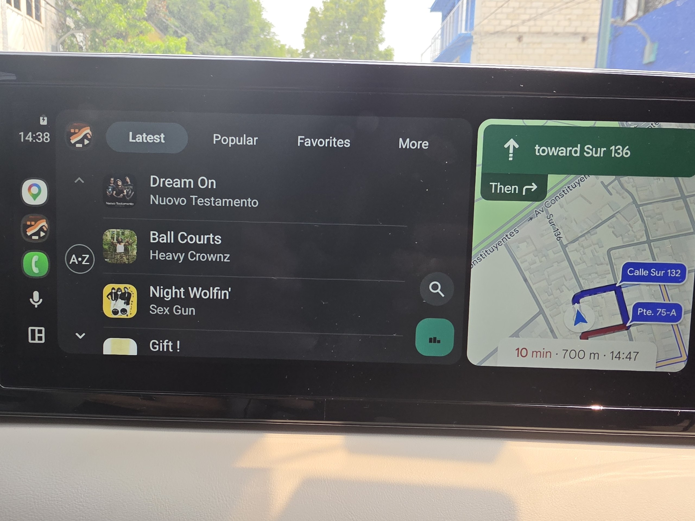
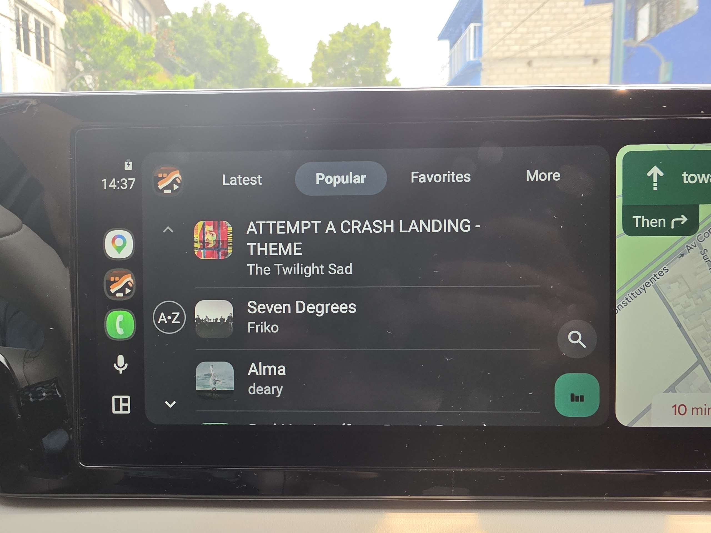
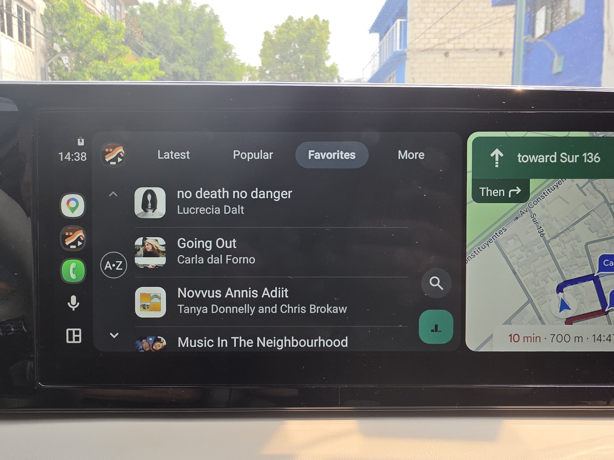
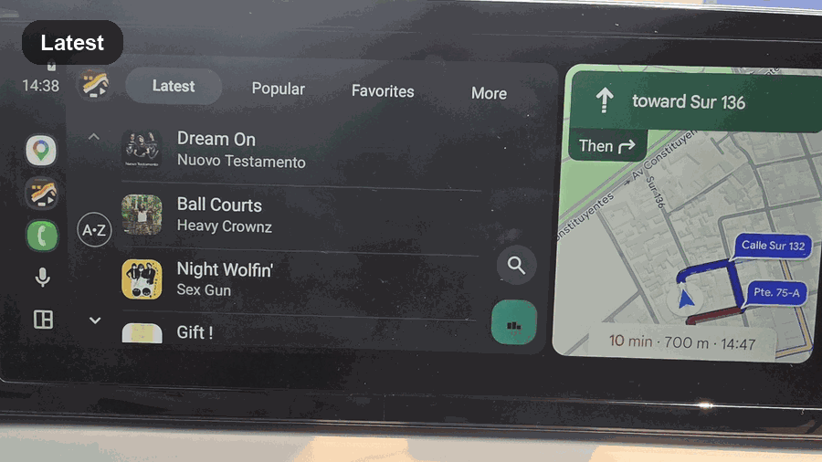
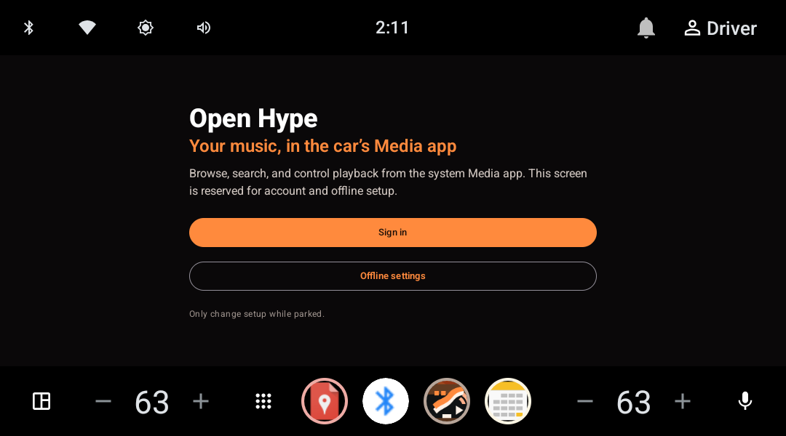

# Hype Car

[](https://github.com/josusanmartin/open-hype/actions/workflows/build.yml)
[](LICENSE)
[](gradle.properties)
[](gradle.properties)

Unofficial open-source Hype Machine client for Android phones and Android Auto / Automotive OS. Streams from `api.hypem.com` and exposes a Media3 `MediaLibraryService` so Android Auto can browse and play your Hype Machine library.

> Not affiliated with or endorsed by Hype Machine.

## Highlights

- Browse Latest, Popular, Favorites, Feed, Playlists, History, blogs, tags, and users.
- Play from a compact mini-player or an adaptive full player with dedicated portrait and landscape layouts.
- Cache favorite tracks for offline listening with configurable storage limits and resilient background sync.
- Use the car's native, driver-safe Media interface on Android Auto and Automotive OS; the app-owned AAOS screen is reserved for parked account and offline setup.
- Keep favorites and account-backed data isolated across sign-in changes, with optimistic updates and server-confirmed rollback.
- English and Spanish UI with screen-reader headings, announced error states, descriptive queue actions, and 48 dp minimum touch targets.
- Baseline and Startup Profiles cover cold launch, catalog scrolling, Search, and Settings navigation.

## Screenshots

### Phone (Pixel 9 Pro XL)

| Latest | Player | Popular | Settings |
| --- | --- | --- | --- |
|  |  |  |  |

### Android Auto / Automotive — system Media Templates

What you actually see in a car: the head unit's media app renders our `MediaLibraryService` through the Android Auto / Automotive Media Templates — the same system surface Spotify, YouTube Music, etc. use. Browse roots come from our `MediaLibrarySession.Callback`; the playback chrome is system-rendered.

#### Latest

<p>
  
</p>

#### Popular

<p>
  
</p>

#### Favorites

<p>
  
</p>

<p>
  
</p>

[`MP4 demo`](docs/media/android-auto-browse.mp4)

The heart in the Now Playing surface is a `CommandButton` that requests a secondary action slot with overflow fallback, so AAOS keeps the standard transport (`skip-prev / play-pause / skip-next`) intact while still exposing Favorite on real head units. Tapping it dispatches a custom `SessionCommand` to `MeRepository.toggleFavorite(...)` for the playing track, with optimistic UI and server-confirmed rollback. Favorites / Feed / Playlists roots gate on `AuthRepository.session` and return a non-playable placeholder when there's no Hype Machine login, so the system shows "Media isn't available" instead of a generic error. Artwork fetching is routed through an `OkHttpBitmapLoader` backed by the app's already-trusted `OkHttpClient` so the system notification + Now Playing in real cars don't depend on the head unit's trust store. Android Auto section logos are embedded as PNG artwork bytes instead of vector resource URIs because some projected hosts render local vector artwork as blank white tiles.

> Screenshots and demo above are projected Android Auto running on a real head unit in split-screen mode with Maps. Emulator QA still uses `AAOS_API_35` and launches `com.android.car.media` with `-a android.car.intent.action.MEDIA_TEMPLATE` against `dev.josu.hypecar/dev.josu.hypecar.auto.service.HypeMediaLibraryService`, but those captures are not used here because the emulator can show host chrome, placeholder art, and clipped template overlays that do not match real projection.

### AAOS — parked setup (when launched directly)

When the user taps the app icon on AAOS, Open Hype presents only account and offline setup. Browsing, search, queue management, and playback remain in the vehicle's native Media app so the driving experience follows the host's safety rules and interaction model.

| Parked setup |
| --- |
|  |

## Modules

```
app/                  Phone shell (Compose UI, navigation, mini-player chrome)
auto/                 Media3 MediaLibraryService + MediaLibrarySession.Callback for AAOS / Auto
baselineprofile/      Baseline Profile generation + startup/navigation Macrobenchmarks
core/
  model/              Domain models, repository interfaces, coroutine helpers
  network/            Retrofit API + DTOs + auth interceptor
  data/               Room DB, DataStore, repositories, OkHttp wiring, offline sync worker
  playback/           ExoPlayer wrapper (HypePlaybackManager) + foreground-service starter
feature/
  auth/               Login flow + ViewModel
  catalog/            Latest / Popular routes
  library/            Library route (favorites, playlists, friends, history)
  search/             Search route
  details/            Blog / Tag / User detail routes
  player/             Full-screen player UI
scripts/              Dev helpers (HypeM dev proxy, AAOS Wi-Fi reconnect)
```

## Tech stack

- **UI:** Jetpack Compose · Material 3 · Navigation Compose
- **DI:** Hilt + KSP
- **Data:** Room · DataStore (Preferences) · WorkManager (offline sync)
- **Networking:** Retrofit · OkHttp · `okhttp-dnsoverhttps` fallback (`ResilientDns`) · `kotlinx.serialization`
- **Playback:** Media3 1.10.1 ExoPlayer + `MediaLibrarySession`
- **Images:** Coil
- **Build:** AGP 8.10.1 · Kotlin 2.0.21 · JDK 17 · Gradle 8.11.1
- **Testing:** JUnit4 · Truth · MockWebServer · Robolectric · Kotlinx Coroutines Test · AndroidX Macrobenchmark
- **Coverage:** Kover (`./gradlew koverHtmlReport` → `build/reports/kover/html/index.html`)
- **Performance:** generated Baseline + Startup Profiles packaged into release builds
- **CI:** GitHub Actions (`.github/workflows/build.yml`) — formatting + architecture + debug/release tests + lint + Kover + R8 release packaging

SDK levels (`gradle.properties`): `compileSdk=36`, `targetSdk=36`, `minSdk=26`.

## Building

Requires JDK 17. The Gradle wrapper handles everything else.

```bash
# Run unit tests + lint (fast)
./gradlew testDebugUnitTest lintDebug

# Run the complete local quality pipeline
scripts/dev.sh ci

# Build a debug APK
./gradlew :app:assembleDebug

# Build Play-ready release artifacts (requires signing env vars)
./gradlew -PrequireReleaseSigning=true :app:assembleRelease :app:bundleRelease
```

Outputs land in `app/build/outputs/`.

To verify that the generated Baseline Profile is present in the optimized release APK without using a device:

```bash
scripts/dev.sh profile-check
```

### Release signing

Provide the keystore via Gradle properties or environment variables — never commit them. See `RELEASE.md` for the full checklist.

```bash
export HYPE_RELEASE_STORE_FILE=/absolute/path/to/release.keystore
export HYPE_RELEASE_STORE_PASSWORD='...'
export HYPE_RELEASE_KEY_ALIAS='...'
export HYPE_RELEASE_KEY_PASSWORD='...'

./gradlew clean testDebugUnitTest lintDebug -PrequireReleaseSigning=true bundleRelease
# → app/build/outputs/bundle/release/app-release.aab
```

The Play-ready commands above pass `-PrequireReleaseSigning=true`, so missing signing variables fail fast. A plain Gradle release task may still produce an unsigned artifact for local R8 verification; never distribute that output. The GitHub release workflow also fails before publishing unless every release-signing secret is configured. Use `./gradlew :app:assembleDebug` for local installable builds.

## Running on Android Auto / AAOS

The app declares an automotive media app (`res/xml/automotive_app_desc.xml` → `<uses name="media" />`) and a `HypeMediaLibraryService` that satisfies the AAOS browser tree contract. The service explicitly opts into AAOS media-source discovery, so Open Hype appears in the native source picker after a sideload or install.

Distribution note: the current unified artifact supports projected Android Auto and AAOS emulator/sideload testing, but it is not a Play-ready AAOS artifact. Google Play requires a dedicated automotive application build/track with `android.hardware.type.automotive` required, no phone launcher, and automotive-only metadata. Do not upload the current mobile bundle to an AAOS track.

For AAOS emulator development, the `core:data` debug build enables `ENABLE_AAOS_DEV_PROXY`, which routes requests through `http://10.0.2.2:8787/v2/` when the runtime detects an automotive emulator. Run the proxy locally:

```bash
python3 scripts/hypem_api_proxy.py
```

Release builds always go directly to `https://api.hypem.com/v2/`.

## Networking & security

- `cleartextTrafficPermitted="false"` in the base network security config; debug variant whitelists `10.0.2.2` / `localhost` only.
- `HypeApiInterceptor` injects the auth token (`hm_token` query param) **only** for `api.hypem.com` and the dev proxy hosts.
- The auth token is encrypted at rest with Android Keystore (AES-GCM) via `AndroidKeystoreSessionTokenCipher`; legacy plaintext tokens auto-migrate on first read.
- `data_extraction_rules.xml` + `allowBackup="false"` exclude the session DataStore, Room DB, and shared prefs from cloud backup and device transfer.
- In debug automotive-emulator proxy builds only, `ResilientDns` may fall back to DNS-over-HTTPS for Hype-owned hosts when the system resolver throws `UnknownHostException`. Release builds and unrelated hosts always use the system resolver.

## Permissions

Declared in `app/src/main/AndroidManifest.xml`:

| Permission | Purpose |
|---|---|
| `INTERNET` | API calls |
| `ACCESS_NETWORK_STATE` | Connectivity and offline-state feedback |
| `WAKE_LOCK` | ExoPlayer `WAKE_MODE_NETWORK` for background streaming |
| `FOREGROUND_SERVICE` + `FOREGROUND_SERVICE_MEDIA_PLAYBACK` | Media3 playback service |

The app does not request `POST_NOTIFICATIONS`: Android exempts notifications tied to media sessions from that runtime permission, so prompting would add friction without enabling playback controls.

## Project layout conventions

- App ID: `dev.josu.hypecar`. Module namespaces follow `dev.josu.hypecar.<module-path>`.
- Public Hilt graph lives in `core/data/.../di/DataModule.kt`. Playback DI in `core/playback/.../di/PlaybackModule.kt`. App-level wiring in `app/.../AppPlaybackModule.kt`.
- Repositories implement interfaces declared in `core:model`; UI features depend on `core:model` (and Hilt-provided implementations from `core:data`).
- Errors are propagated via `Result<T>` / `runSuspendCatchingPreservingCancellation` (preserves `CancellationException`) — no `!!`, and no `runBlocking` outside unavoidable synchronous platform boundaries such as Media3 callbacks and OkHttp token interception.

## Releases

Published builds live on [GitHub Releases](https://github.com/josusanmartin/open-hype/releases) — pushing a `v*` tag packages and attaches the APK/AAB automatically. Per-version changelog notes live in [`CHANGELOG.md`](CHANGELOG.md). To stage the same artifacts locally from the current tree:

```bash
scripts/dev.sh release
#  dist/<version>/hype-car-<version>-release.apk
#  dist/<version>/hype-car-<version>-release.aab
```

## Useful scripts

- `scripts/dev.sh` — single dev-experience entry point: `check`, `ci`, `format`, `coverage`, `profile-check`, `install`, `release`. Run with no args for the menu.
- `scripts/hypem_api_proxy.py` — local HTTP proxy that forwards to `https://api.hypem.com`, used for AAOS emulator dev.
- `scripts/aaos_reconnect_wifi.sh` — reconnects the AAOS emulator to the host Wi-Fi (works around emulator network flakes).

## Project docs

| Doc | Purpose |
|---|---|
| [`CONTRIBUTING.md`](CONTRIBUTING.md) | Dev setup, code style, test patterns, release flow |
| [`CHANGELOG.md`](CHANGELOG.md) | Per-version release notes |
| [`SECURITY.md`](SECURITY.md) | Coordinated-disclosure policy for vulnerability reports |
| [`RELEASE.md`](RELEASE.md) | Release-checklist (signing, Play Store metadata) |
| [`baselineprofile/README.md`](baselineprofile/README.md) | Profile generation, packaging checks, and benchmark usage |
| [`LICENSE`](LICENSE) | MIT |

## License / disclaimer

This is an unofficial third-party client. All Hype Machine content and trademarks belong to their respective owners.
